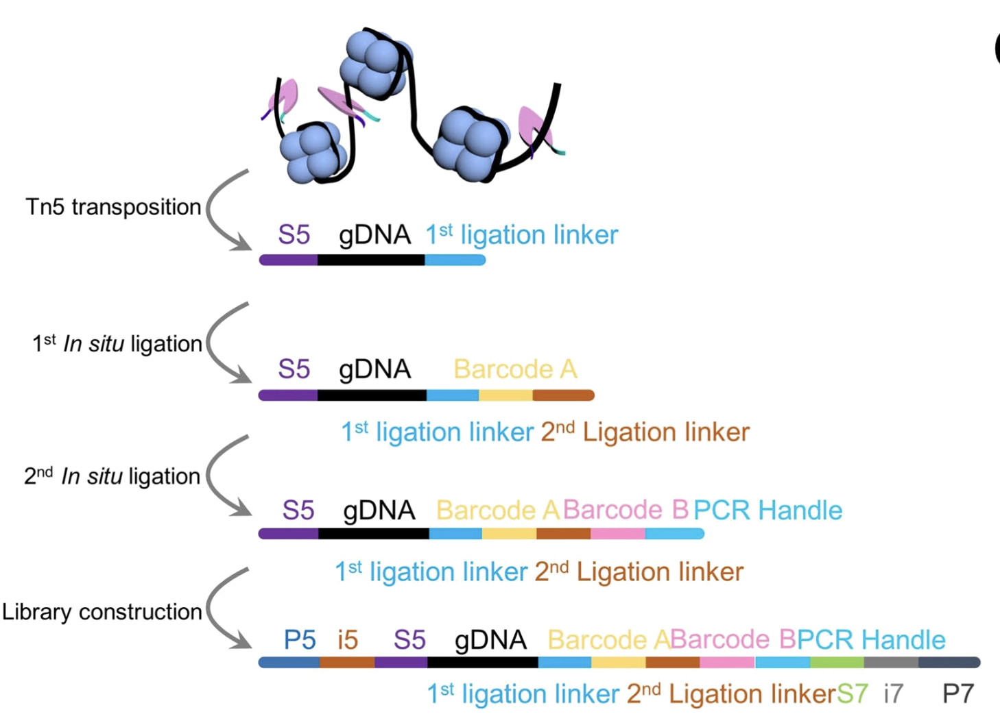

# barcodeqc

`barcodeqc` is a lightweight command-line tool for rapid quality control of AtlasXomics epigenomic DBiT-seq experiments. It analyzes Read 2 barcodes and ligation linkers to flag common upstream failure modes and produces a single HTML report for a go/no-go decision.

The tool expects Illumina short-read data using the barcoding schema described in [Zhang et al. 2023.](https://www.nature.com/articles/s41586-023-05795-1)

- Read 1: genomic sequence
- Read 2: linker1 | barcodeA | linker2 | barcodeB | genomic sequence

<div>
    
</div>

**What It Checks**
- Linker conservation (L1 and L2)
- Barcode whitelist mismatch
- High or low barcode lanes
- Off-tissue ratio (when a tissue positions file is provided)

## Steps
Pipeline stages executed by `barcodeqc qc`:

1. Subsample Read 2 with `seqtk sample` and write `ds_<sample_reads>.fastq.gz`.
2. Run `cutadapt` for linker 1 and linker 2 independently, writing wildcard barcode files and logs.
3. Build `spatialTable.csv` by merging linker barcode calls and joining to tissue positions.
4. For each linker, compute barcode count metrics, whitelist checks, and lane QC flags; write count tables and QC plots.
5. If tissue positions are available, compute on/off tissue metrics and generate the on/off density plot.
6. Build the summary QC table, print a terminal status table, and render the final HTML report.

## Requirements
- macOS or Linux
- Python 3.10+
- `seqtk` 1.4+ on PATH
- `cutadapt` (installed automatically via `pip`, provides the `cutadapt` CLI)

## Installation

### From source:

> Make sure the interpreter used to create the virtual environment is Python 3.10 or newer. On systems with multiple Python installs, use an explicit binary such as `python3.10` or `python3.11`.

```bash
git clone https://github.com/atlasxomics/barcodeqc.git
cd barcodeqc
python -m venv .venv
source .venv/bin/activate
pip install -U pip
pip install .
```

### Install seqtk
`barcodeqc` uses `seqtk sample` during subsampling, so `seqtk` must be on your PATH.

macOS (Homebrew):

```bash
brew install seqtk
```

Linux (Debian/Ubuntu):

```bash
sudo apt-get update
sudo apt-get install -y seqtk
```

Conda or Mamba:

```bash
mamba install -c bioconda seqtk
# or
conda install -c bioconda seqtk
```

Verify installation:

```bash
which seqtk
```

## Quick Start

```bash
barcodeqc qc -n SAMPLE_NAME -f /path/to/read2.fastq.gz  -b bc220
```

If you do not provide `--tissue_position_file`, the tool uses the packaged tissue positions file for the selected barcode set.

## Commands

`qc` runs the full pipeline and generates figures, tables, and the HTML report.

```bash
barcodeqc qc -n SAMPLE_NAME -f /path/to/read2.fastq.gz -b bc96
```

`report` regenerates the HTML report from an existing run directory.

```bash
barcodeqc report -n SAMPLE_NAME -d /path/to/SAMPLE_NAME
```

## Inputs
- `--sample_name`: label used for the output directory and report name
- `--r2_path`: Read 2 fastq or fastq.gz file
- `--barcode_set`: one of `bc50`, `bc96`, `fg96`, `bc220`, `bc220_05-OCT`, `bc220_20-MAY`
- `--sample_reads`: number of reads to subsample (default `10000000`)
- `--random_seed`: seed for subsampling (default `42`)
- `--tissue_position_file`: optional tissue_positions_list.csv from AtlasXBrowser
- `--dry_run`: create the output directory but skip running the pipeline

## Outputs
Each run creates a directory named after `--sample_name` in the current working directory.

```text
SAMPLE_NAME/
  SAMPLE_NAME_bcQC_report.html
  ds_10000000.fastq.gz
  figures/
    L1_barplot.html
    L2_barplot.html
    L1_pareto.html
    L2_pareto.html
    dense_on_off.html
  tables/
    spatialTable.csv
    L1_counts.csv
    L2_counts.csv
    L1_hiLoWarn.csv
    L2_hiLoWarn.csv
    onoff_tissue_table.csv
    qc_table.csv
    input_parameters.json
  logs/
    cutadapt_L1.log
    cutadapt_L2.log
```

The console also prints a summary table with PASS or CAUTION statuses for each QC metric.

Notes on optional outputs:
- `dense_on_off.html` and `onoff_tissue_table.csv` are only created when a tissue positions file is provided.
- `L1_hiLoWarn.csv` and `L2_hiLoWarn.csv` are only created if high or low lanes are detected.

### Interpreting Results
- `PASS` indicates the metric is within expected bounds.
- `CAUTION` indicates the metric falls outside the expected range and should be reviewed in the report.

## Troubleshooting
- `seqtk` not found: install `seqtk` and ensure it is on PATH.
- `cutadapt` not found: ensure the active environment includes `cutadapt` and the `cutadapt` CLI is available.
- Missing or incorrect tissue positions: provide a valid `tissue_positions_list.csv` or rely on the default barcode-set positions file.
- Logs are written to `barcodeqc.log` and `SAMPLE_NAME/logs/`.
- Contact your AtlasXomics Support Scientist if you encounter persistent issues.
